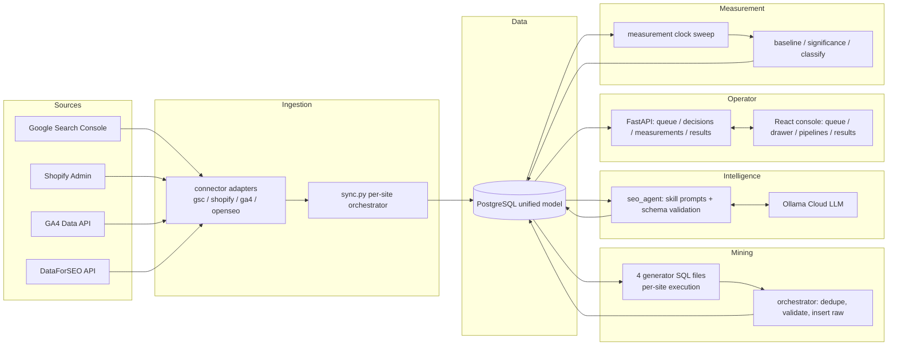
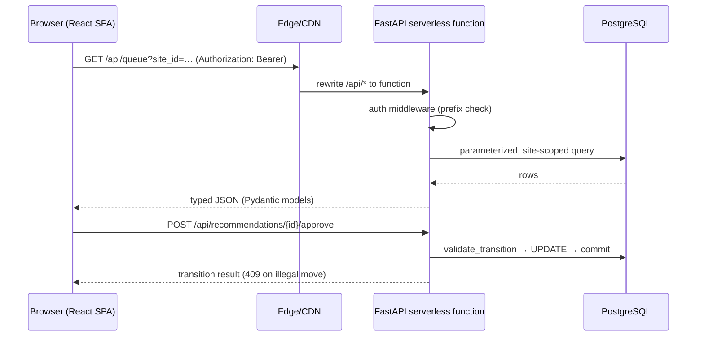

# OpenSEO++ — Project Walkthrough

## 1. Overview

OpenSEO++ is an SEO operations platform for e-commerce catalogues. It runs a
repeating weekly cycle: it ingests search, catalogue, and analytics data into
a unified PostgreSQL model; mines that data for concrete, evidence-backed SEO
opportunities; evaluates the strongest candidates with an LLM agent that
applies documented skill playbooks; presents at most five enriched
recommendations per site to a human operator; and then measures whether each
shipped change actually moved organic performance.

The problem it solves is structural: SEO work for online stores is usually
manual, unfocused, and unmeasured. Audits produce long lists of plausible
tasks with no prioritization, no evidence, and no follow-up. OpenSEO++
replaces that with a closed loop — every recommendation carries its evidence,
every outcome is classified against a baseline with a statistical noise
filter, and every rejection feeds back into the next agent run.

Human judgment stays in the loop by design: nothing is published
automatically. The operator approves, rejects with a reason, assigns, and
marks work live from a web console; the system handles the analysis,
enrichment, tracking, and measurement around them.

## 2. What's Been Built

### Data ingestion layer — `src/connectors/`

| Module | Role |
|---|---|
| `gsc.py` | Google Search Console adapter: site listing and search-analytics queries (date, query, page, country, device dimensions), service-account token minting, mock/fixture serving |
| `shopify.py` | Shopify Admin adapter: products, variants, inventory, collections, published state |
| `ga4.py` | GA4 Data API adapter: page-level organic sessions, conversions, revenue |
| `openseo.py` | OpenSEO facade: resolves the single shared credential (`get_openseo_adapter()`), the only code path touching the secret; resolves mode, base URL, capability list |
| `openseo_rest_adapter.py` | DataForSEO REST adapter: typed `supports()`/`fetch()` contract, request-body builders and response normalizers for keyword volume, SERP, competitors, backlinks, and on-page crawl audit; extracts provider-reported cost from every raw envelope |
| `sync.py` | Per-site sync orchestrator (`run_sync()`): GSC performance, pages from catalogue, GA4 business performance, keyword clusters, SERP snapshots, crawl audit, catalogue coverage, page–query match scores; TTL freshness gates per capability |
| `mode.py` | Central integration-mode switch (`resolve_mode()`): one variable governs mock vs. live for every connector, with legacy per-connector overrides |
| `costlog.py` | Cost logging into `api_costs`, weekly spend aggregation, budget-cap enforcement with warning thresholds |

### Opportunity mining — `src/generators/` and `plan/*.sql`

| Module | Role |
|---|---|
| `runner.py` | Loads generator SQL from `plan/`, binds site id and reference date per site, returns candidate rows as dictionaries |
| `orchestrator.py` | Runs the four generators per site, builds typed candidate rows, deduplicates, validates action types, inserts recommendations as raw rows, records candidate runs |
| `plan/01-generator-missing-pages.sql` | Search demand with no matching page (catalogue depth + SERP competitor signals) |
| `plan/02-generator-existing-opportunities.sql` | Underperforming existing pages (position window, CTR drop, click decline signals) |
| `plan/03-generator-technical-root-causes.sql` | Indexability, canonical, status, sitemap, orphan-depth, structured-data, and JS-rendering root causes |
| `plan/04-generator-cannibalization.sql` | Two own-domain pages alternating rankings for one cluster, with weekly-position evidence |

### AI agent — `src/agents/`

| Module | Role |
|---|---|
| `seo_agent.py` | Payload assembly (`build_agent_input()`), skill-file prompt composition (`build_system_prompt()`), strict output validation (`validate_agent_output()`), persistence (`persist_agent_output()`), the only promoter of raw → proposed (`run_agent()`) |
| `ollama_client.py` | Hosted Ollama Cloud client: JSON-mode chat, retry on truncated JSON, usage capture, loud config errors when credentials are absent |
| `prompts/agent_system.md` | System prompt: rules of priority, per-type skill summaries, exact JSON output schema, five-recommendation cap |

Skill playbooks live in `plan/` and are injected verbatim per generator present
in a batch: technical-fix rules (`16-skill-technical-fix.md`) and
cannibalization/consolidation rules (`17-skill-consolidate-cannibalization.md`);
missing-page and existing-opportunity rules are carried inline in the system
prompt.

### Measurement — `src/measurement/`

| Module | Role |
|---|---|
| `baseline.py` | Freezes pre-implementation baseline: target page delta, comparable control pages, optional year-over-year context |
| `measure.py` | Action-type-specific observation windows resolved from the `measurement_window_lookup` table |
| `classify.py` | Won / Neutral / Lost / Inconclusive verdicts with a confounding-trend check |
| `significance.py` | Two-proportion/binomial significance test scaled by sample size — a noise filter, not a causal claim |

### Operator API — `src/api/`

| Endpoint group | Operations |
|---|---|
| `routes/queue.py` | Queue listing with typed filters and site-scoped limits, per-site site bootstrap, stale-approval surfacing, full recommendation detail (evidence, work, measurement plan, cluster, catalogue coverage, SERP context), active pipeline view (approved + in-progress rows) |
| `routes/decisions.py` | Approve, reject (reason mandatory, persisted to `rejection_log`), assign owner, mark live |
| `routes/measurements.py` | Mark implemented (baseline freeze), safe-implement variant, measurement fetch, results dashboard feed, on-demand measurement sweep |
| `common.py` | Shared connection handling, row fetch helper, the single `TRANSITIONS` table and `validate_transition()` gate (409 on illegal moves) |
| `main.py` | FastAPI app: health endpoint (DB-status reporting without failing), CORS middleware for local SPA development, bearer-token middleware over data prefixes, `/api`-prefixed mounts, static SPA hosting when a build is present |

### Operator console — `apps/openseo-plus/`

React 19 + Vite + TanStack Router/Query application with three data surfaces
and a detail drawer:

- **Action Queue** (`features/operator/queue/`): filterable, searchable card
  list with impact/effort/owner chips, search-volume badges, high-impact and
  quick-win presets, and an "N of M" counter that respects active filters.
- **Detail drawer** (`components/DetailDrawer.tsx`): full case file per
  recommendation — evidence panel, work-required items with acceptance
  criteria, measurement plan, cluster context, "who outranks you" SERP ladder
  with own-domain highlighting, catalogue coverage block — plus approve /
  reject-with-reason / assign actions.
- **Pipelines** (`features/operator/pipelines/`): approved and in-progress
  work with observation-window countdowns.
- **Results** (`features/operator/results/`): Won/Neutral/Lost trend chart,
  outcome breakdown table, per-result detail modal.
- Shared data layer (`data/useOperatorData.ts`): one API client that targets
  the same-origin `/api` prefix, typed queue/pipeline/results hooks, React
  Query caching.

### Background jobs — `src/jobs/`

| Job | Role |
|---|---|
| `daily_sync.py` | Connector sync with pre-flight budget checks and summary/budget notifications |
| `weekly_candidates.py` | Per-site generator runs across all configured sites |
| `weekly_agent.py` | Per-site agent passes, gated by the Ollama budget check |
| `weekly_crawl.py` | Pulls crawl/audit data through the OpenSEO adapter |
| `semantic_scoring.py` | Embedding-based cluster/page similarity feeding the semantic content score |
| `measurements.py` / `measurement_clock.py` | Daily sweep that measures any live recommendation whose observation window has closed |
| `stale_approvals.py` | Surfaces approvals sitting unimplemented past the threshold |
| `cost_report.py` | Weekly spend reporting by service |
| `notify.py` | Webhook summaries, budget alerts, failure alerts (silently skipped when unconfigured) |
| `run_multi.py` | Bounded-concurrency, failure-isolated multi-site runner with optional per-site timeout |

### Tests — `tests/`

Standalone suites covering mock-mode connector behavior, integration of sync +
generators, agent validation and persistence, the API surface, measurements,
GSC adapter, and a full day-in-the-life run (sync → generate → evaluate →
approve → measure) against a real database.

## 3. Capabilities

From an operator's perspective, the system today can:

- **Sync a store's SEO-relevant reality** — search performance per query and
  page, catalogue with inventory-aware stock states, page-level organic
  conversions and revenue, keyword search volumes, live SERP snapshots, and
  site-audit crawl data — into one queryable model, refreshed on a schedule
  with TTL-based de-duplication of paid calls.
- **Surface a weekly shortlist** — up to five recommendations per site, each
  carrying a diagnosis, structured evidence (sources include Search Console,
  catalogue, SERP, and crawl data), concrete work items with acceptance
  criteria, impact/confidence/effort/owner, and a measurement window matched
  to the action type.
- **Explain itself** — every card opens into a case file: the keyword cluster
  and its volume, the exact GSC signals, the competitor results occupying the
  positions above, the catalogue depth behind the claim, and the planned
  measurement approach.
- **Enforce a safe workflow** — approve, reject (reason mandatory), assign,
  implement (baseline snapshot), mark live, and let the clock measure; illegal
  state jumps are rejected at the API layer, not just hidden in the UI.
- **Learn from rejection** — operator rejection reasons and agent rejections
  are logged with context and injected into subsequent agent prompts, so
  previously-refuted patterns stop resurfacing.
- **Prove outcomes** — after the action-type-specific window, the system
  compares post-change performance to the frozen baseline and control pages,
  applies a significance test, and classifies the result; verdicts feed the
  results dashboard and the learning loop.
- **Protect the budget** — every paid call is cost-logged with the
  provider-reported cost; weekly caps per service and globally trigger
  warnings at a configurable threshold and hard-stop jobs that would exceed
  the cap.
- **Run many sites safely** — jobs execute per site with isolated database
  connections, per-site quotas, bounded concurrency, and per-site failure
  isolation.

## 4. Architecture

### Component boundaries

The system is four loosely-coupled layers around one PostgreSQL database:
connectors write a normalized data model; generators and the agent read that
model and write candidate/recommendation rows; the API reads recommendations
and applies operator state transitions; measurement jobs close the loop. The
SPA talks only to the API. Nothing in the pipeline reaches the network
without the mode layer explicitly allowing it.

### The weekly processing pipeline

1. **Daily sync** — per site, the sync orchestrator pulls Search Console
   analytics (last seven days, dimensioned by query/page/device/country),
   catalogue products and collections (stock computed per the site's
   in-stock definition), GA4 page performance, and — subject to TTL gates —
   keyword volumes, SERP snapshots, and crawl-audit summaries from
   DataForSEO. It then recomputes catalogue coverage per keyword cluster and
   page–query match scores. Every capability call is cost-logged with the
   provider-reported amount; a budget pre-flight can stop the job before any
   spend.
2. **Candidate generation (weekly)** — the orchestrator runs the four
   generator SQL files per site with the site id and reference date bound as
   parameters. Each generator applies its own validation: deduplication by
   cluster, brand-query exclusion, catalogue-size-tier thresholds (resolved
   from `threshold_tiers` with per-site overrides), in-stock qualification,
   and exclusion of clusters/targets already carrying an active
   recommendation. Survivors are capped per generator, merged, deduplicated
   again, and inserted as raw recommendations.
3. **Agent evaluation (weekly)** — the agent builds one payload per site:
   candidates with their cluster context, structured generator evidence, live
   SERP rows, page context (indexability, rendering, crawl depth, internal
   links, 28-day GSC aggregates), site configuration, the last rejections as
   few-shot context, and output limits. The system prompt is composed
   deterministically from the base prompt plus the skill file for each
   generator present in the batch. The model returns strict JSON; validation
   enforces the schema, action-type vocabulary against the measurement
   lookup, and candidate-id matching. Accepted candidates are enriched and
   promoted to proposed; rejected ones are moved to rejected with a reason
   and logged.
4. **Operator loop (human-paced)** — the console reads the queue, shows
   evidence, and applies transitions through the API. Approve → implement →
   live → measured is enforced by the transition table; a rejection requires
   a reason and lands in the rejection log.
5. **Measurement (continuous)** — the measurement clock sweeps daily for live
   recommendations whose window has elapsed, pulls post-period performance,
   compares against the stored baseline and control pages, runs the
   significance test, and writes the verdict and snapshots.

```mermaid
stateDiagram-v2
    [*] --> raw: generators insert candidate
    raw --> proposed: agent accepts + enriches
    raw --> rejected: agent rejects (reason logged)
    proposed --> approved: operator approves
    proposed --> rejected: operator rejects (reason logged)
    approved --> in_progress: team starts work
    in_progress --> live: change shipped
    live --> measured: window closes; baseline vs. post + significance test
    rejected --> [*]: reason feeds next agent prompt
    measured --> [*]: verdict (won / neutral / lost / inconclusive)
```

### Data model (principal tables)

| Table | Purpose |
|---|---|
| `site_config` | Per-site identity, domain, GSC property, catalogue tier, threshold overrides, brand queries, agent tuning (prefetch/backup limits, cooldown days) |
| `threshold_tiers` | Default sensitivity thresholds by catalogue size (small/medium/large) |
| `pages` | Catalogue URLs with page type, title, indexability, canonical, crawl depth, link counts, structured-data flag, render status, HTML hash pair |
| `search_performance` | GSC rows: date × query × page × country × device with clicks, impressions, CTR, position |
| `page_business_performance` | GA4 organic sessions, engagement, carts, checkouts, orders, revenue per page/day |
| `keyword_clusters` / `cluster_queries` | Keyword groupings with volume, intent, commercial flags, recommended page type |
| `openseo_serp_snapshots` | Per-query SERP result rows: URL, domain, position, own-domain flag, snapshot date |
| `catalogue_coverage` | Per-cluster product match counts, in-stock counts, average price, existing collection URL |
| `page_query_match_scores` | Weighted intent/catalogue/GSC/semantic match scores per page–cluster pair |
| `recommendations` | The pipeline spine: diagnosis, evidence JSON, work-required JSON, impact/confidence/effort/owner, status, assignment, measurement fields, verdict |
| `change_log` / `measurement_snapshots` | Implementation records and baseline/post snapshots |
| `rejection_log` | Operator and agent rejections with reasons — the learning-loop source |
| `candidate_runs` | Per-run generator output counts (audit trail) |
| `api_costs` / `budget_config` | Per-call cost ledger and weekly caps with warning thresholds |
| `measurement_window_lookup` | Observation days per action type — single source of truth |

### Request pipeline (production)

The console and the API share one origin in production: the SPA is served
statically, and API paths are rewritten to the FastAPI serverless function,
which connects to PostgreSQL over TLS. Bearer-token middleware protects all
data prefixes; health stays public and reports degraded (never 500) when the
database is unreachable.

### External integrations

| Service | Access | Capabilities used |
|---|---|---|
| Google Search Console | Per-site service account or token | Site listing, search analytics |
| Shopify | Per-site admin token | Products (variants, inventory), collections (published state) |
| GA4 | Per-site property credentials | Page performance (sessions, conversions, revenue) |
| DataForSEO | One shared company credential | Keyword search volume, Google organic SERP, competitor domains, backlinks, on-page crawl summary |
| Ollama Cloud | One API key | Chat completions in JSON mode for agent evaluation |

Background/async processing is batch-oriented: jobs are plain Python entry
points executed by an external scheduler, with a shared multi-site runner
providing bounded concurrency (strictly sequential by default, honoring
DataForSEO rate limits), per-site timeout accounting, and failure isolation.

## 5. Data Layer & Store Integration Readiness

This layer is where the architecture pays for itself, so it is worth being
precise about what is generic and what is provider-specific.

### The abstraction contract

Every external data source is reached through the same two-method adapter
contract: a capability check and a fetch that takes a capability name plus
parameters and returns a normalized, typed result. Callers never touch HTTP
clients, provider payloads, or credentials directly. Each adapter:

- exposes a fixed capability vocabulary (for example, search analytics,
  keyword volume, SERP, competitors, backlinks, crawl summary);
- normalizes provider responses into flat dictionaries whose keys are the
  pipeline's vocabulary, so downstream SQL and Python never see
  provider-specific shapes;
- never raises on provider failure — fetch returns a typed error result, and
  callers follow a uniform "skip and log, never crash" policy;
- resolves its mode (mock vs. live) through one central resolver with a safe
  default, so no code path touches the network unless that path is
  explicitly switched on.

The sync orchestrator (`sync.py`) is the composition layer: it builds the
adapters, applies TTL freshness gates per capability so paid data is not
re-fetched while still fresh, writes normalized rows into the unified model
with idempotent upserts, and wires the cost-logging callback so every
successful paid call records its provider-reported cost. Downstream of the
database — generators, agent, API, UI — there is no notion of "Shopify" or
"Search Console" at all; they read the unified model.

The OpenSEO/DataForSEO side additionally enforces a single-credential
discipline: one facade function is the only code path allowed to resolve the
shared secret, config lives system-global (never per site), and each call
passes its target (domain, keyword set) as a parameter rather than a
credential selector.

### The mock layer, and why it exists

Each adapter carries a built-in fixture mode. When mock mode is active, the
adapter serves a curated JSON fixture from the shared fixtures directory
instead of calling the provider, normalizes it through the exact same code
path as a live response, and — since the cost-capture change — records the
fixture's cost field into the ledger as well. Fixtures exist for every
capability: Search Console analytics rows, Shopify products and collections,
GA4 page performance, and DataForSEO keyword-volume, SERP, competitor,
backlink, and crawl-audit payloads.

This is not a parallel demo pipeline. It is the same pipeline: the same sync
orchestrator, the same generators, the same agent prompts and validation, the
same API responses, the same UI. The only difference is which
implementation behind the adapter interface answers the fetch. That is what
makes it a validation harness: the full loop — ingestion, mining, agent
enrichment, operator transitions, baseline freezing, significance-tested
measurement — runs end-to-end against realistic data, with deterministic
dates anchored so the generator SQL's weekly windows are stable in tests.

A demo storefront ("Aurora Audio") exercises the catalogue semantics the
generators depend on: published and unpublished collections, draft products,
out-of-stock variants, indexability and canonical defects, JS-rendering
failures, orphan pages, and a keyword cluster with genuine catalogue depth
behind it.

### What changes when a live store connects — and what does not

Switching a source from fixture to live is configuration plus credentials,
not code:

| Concern | Fixture mode (today) | Live store connection |
|---|---|---|
| Connector code | Same adapters | Same adapters |
| Response normalization | Identical | Identical |
| Database schema | Identical | Identical |
| Generators, agent, API, UI | Unchanged | Unchanged |
| Mode resolution | Mock default | Mode set to live (central switch, or per connector) |
| Credentials | None required | GSC service-account key; Shopify domain + admin token; GA4 property + credentials; one shared DataForSEO credential |
| Data realism | Curated fixtures, anchored dates | Real queries, real inventory, real SERPs |
| Cost accrual | Fixture cost fields (deterministic) | Provider-billed amounts, same ledger |
| Rate limits | None | Provider limits; runner is sequential by default |

What does need attention on cutover, none of it architectural:

- **Credentials and mode flags** supplied through the environment for each
  connector, following the same resolution order the adapters already
  implement.
- **GSC property scoping** — the per-site property URL already lives in site
  configuration; the service account needs access to it.
- **Data quality gates** — thresholds tuned for fixture volumes (tier
  defaults) may deserve per-site overrides once real impression volumes are
  visible.
- **First sync TTL behavior** — TTL gates exist to avoid re-buying fresh
  paid data; a first live run bypasses them by design to establish
  baselines.
- **Time-zone anchoring** — fixture runs use an anchored reference date for
  determinism; live runs naturally use the current UTC date, which the
  generator runner already parameterizes.

The design intent is that "connect a real store" is an operations task:
provide credentials, set the mode, run the sync, and the entire downstream
pipeline — candidate mining, agent evaluation, the operator console, and
measurement — behaves identically because it never knew the difference.

## 6. DataForSEO Integration & Cost Model

### APIs used and request shape

All DataForSEO access flows through one REST adapter exposing five
capabilities. Requests are POSTed with a JSON body built per capability
(keywords or target, location and language codes, depth/limit), and responses
are normalized to typed rows; the provider-reported cost is captured from
each raw envelope on every successful call.

| Capability | Endpoint family | Pipeline consumer | Typical batch shape |
|---|---|---|---|
| Keyword volume | Keywords Data → Google search volume (live) | `keyword_clusters.search_volume`, cluster intent/commercial flags | Up to N keywords per request, one location/language per task |
| SERP | SERP → Google organic (live, regular) | `openseo_serp_snapshots` (Generator 1 competitor evidence, drawer "who outranks you") | One keyword per request, depth 10 |
| Competitors | DataForSEO Labs → competitors domain (live) | Domain competitor research | One target domain, limit-bounded |
| Backlinks | Backlinks → live | Backlink evidence (capability-gated) | One target, limit-bounded |
| Crawl audit | On-Page → summary | `pages` audit columns (indexability, canonical, render status) | One target per task, page-count bound |

### Batching, caching, and rate-limit controls

- **Batch endpoints where the provider supports them.** Keyword volume is a
  genuine batch call: a single request prices a list of keywords, and the
  sync uses one request for the site's cluster keywords.
- **TTL freshness gates.** Site configuration carries per-capability TTLs
  (keyword volumes and SERP snapshots each have their own window). A sync
  inside the TTL window skips the paid call entirely and reads the existing
  snapshots.
- **Capability gating.** The adapter exposes only the capabilities enabled
  for the credential; anything else returns a typed unsupported result that
  callers skip and log — an unsupported capability can never become a
  surprise line item.
- **Cost ledger with weekly caps.** Every successful call writes
  service, call type, call count, and provider cost into `api_costs`.
  Weekly caps exist per service and globally, with a warning threshold
  (default 80%); jobs pre-check the budget before making paid calls and
  hard-stop when a cap is exceeded.
- **Sequential multi-site execution.** The runner processes sites one at a
  time by default, respecting DataForSEO rate limits; concurrency is a
  deliberate, bounded configuration choice.

### Observed unit costs

Prices below are the provider-reported amounts captured in the cost ledger
during live verification against a small demo domain (United States
location, English):

| Call | Observed cost | Notes |
|---|---|---|
| Search volume — 1 keyword | $0.0900 | Appears to reflect a per-request minimum |
| Search volume — 5 keywords, one request | $0.0900 | Same request minimum; effectively ~$0.018/keyword at this batch size |
| SERP organic, depth 10 | $0.0020 | Per request, per keyword |
| On-page crawl summary task | $0.5000 | Task-based; scales with the crawl scope the task covers |

### How cost scales with site size and cadence

| Driver | Effect |
|---|---|
| Keyword batch size | Sub-linear up to the per-request minimum; batching the site's full cluster list into one call amortizes the floor |
| SERP refresh frequency | Linear in distinct cluster keywords × refresh count; the 7-day SERP TTL is the primary lever |
| Crawl scope | The dominant cost; scales with pages requested per audit task and audit frequency |
| Number of sites | Linear in sites for SERP/volume; each site consumes its own TTL windows and quota under the shared credential |
| Backup-pool fetching | The agent's prefetch/backup-pool limits bound how many candidates trigger extra evidence fetches per week |

### Worked weekly cost examples

Assuming one site, the standard weekly sync (one keyword-volume batch of 5
keywords, one SERP snapshot per primary cluster — five clusters — and one
crawl-audit task), all inside TTL windows once per week:

| Scenario | Calculation | Weekly cost |
|---|---|---|
| Minimal config — volumes + SERP only | $0.09 (volume) + 5 × $0.002 (SERP) | **$0.10** |
| Full config — adds one crawl-audit task | $0.10 + $0.50 | **$0.60** |
| Larger catalogue — 20 keywords in one batch + SERP for 10 clusters + crawl | ~$0.36 (volume, past the minimum) + 10 × $0.002 + $0.50 | **~$0.88** |
| Multi-site (5 sites), minimal config, TTLs respected | 5 × $0.10 | **~$0.50** |
| Aggressive refresh — SERP daily for 10 clusters | 10 × $0.002 × 7 + volume + crawl | **~$0.78 + $0.59 = ~$1.37** |

The structural takeaway: SERP snapshots are effectively free at demo scale
and cheap at production scale; keyword volume is best amortized in single
batches; crawl auditing is the only line item with meaningful weight, and it
is bounded by task scope rather than request count. Weekly caps with an 80%
warning threshold, TTL gates, and the cost ledger make the monthly envelope
predictable and auditable — spend by service is queryable at any time, and a
cap breach halts spend before it happens rather than after.

## 7. Future Scope

**Integration completion.** The connector layer is built for live cutover;
onboarding real stores means provisioning per-site GSC service accounts,
Shopify tokens, and GA4 properties, and tuning per-site thresholds once real
impression volumes are observable. The OpenSEO/DataForSEO path is already
live-verified end to end (auth, normalization, cost capture, budget
enforcement).

**Crawl-audit depth.** The current on-page integration consumes summary
data; the adapter's capability vocabulary already accommodates richer
crawl payloads (render-status and HTML-hash pairs are modeled in `pages`),
so deeper per-page audit pulls slot in behind the same fetch interface.

**Skill coverage.** The generator → skill-file mapping is designed for
growth: missing-page and existing-opportunity evaluation currently runs from
inline rules; promoting them to full standalone skill files (as exists for
technical fixes and consolidation) tightens per-issue validation and worked
examples without changing any calling code.

**Measurement sophistication.** Control-group matching is currently
rule-based (page type and catalogue similarity); statistical matching, and
eventually Bayesian structural models, are natural upgrades. YoY context is
modeled and optional.

**Scheduling and operations.** Jobs are scheduler-agnostic entry points with
a shared runner; wiring them to managed cron, adding run-history dashboards,
and alert-routing configuration are straightforward operational work rather
than architectural change.

**Multi-tenant hardening.** Site isolation is enforced at the query level
throughout; organization-level accounts, per-operator auth, and audit trails
on top of the existing transition log are the logical next layer.

**Learning loop depth.** Rejection context is explicit few-shot injection by
design (no fine-tuning). As verdict history accumulates, outcome-weighted
prioritization of candidates — feeding measured win rates back into
generator ranking — is the highest-leverage extension, because it closes the
loop from measurement all the way back to what gets proposed.